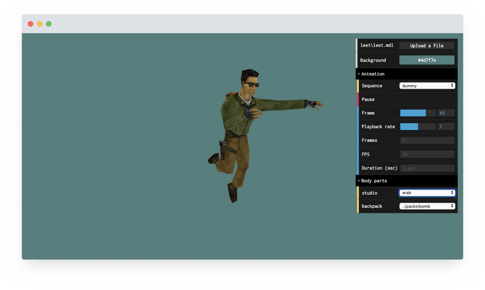

# Web TF2 Model Viewer

This repo was built off the source code powering [danakt.com/web-hlmv](https://danakt.com/web-hlmv). The tool was made as a simple multiplatform alternative to [Half-Life Model Viewer](https://github.com/ValveSoftware/halflife/tree/master/utils/mdlviewer).

  

## Installation!

1. make sure you are using a version of node (I am developing on `v16.19.0`).
   1. this is because openSSL v3.0 has caused issues on later versions.
2. Install the dependencies with `yarn install`
3. run `yarn run start`

## Todo (from parent repo)

- Fix bone positions calculation (resolve problems with weapons rendering)
- Add first person weapons viewing and mirroring model
- Add viewing textures
— Add chrome textures
- Make parsing and processing models in worker
- Make mobile interface

Create an [issue](https://github.com/danakt/web-hlmv/issues) to offer new features.

## License

[MIT](LICENSE) © 2019  
This product was made using technologies licensed from id Software and Valve
Corporation.
